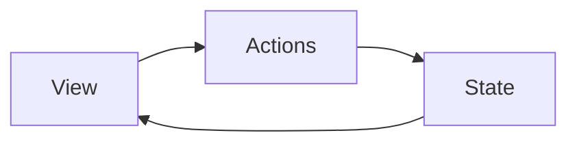
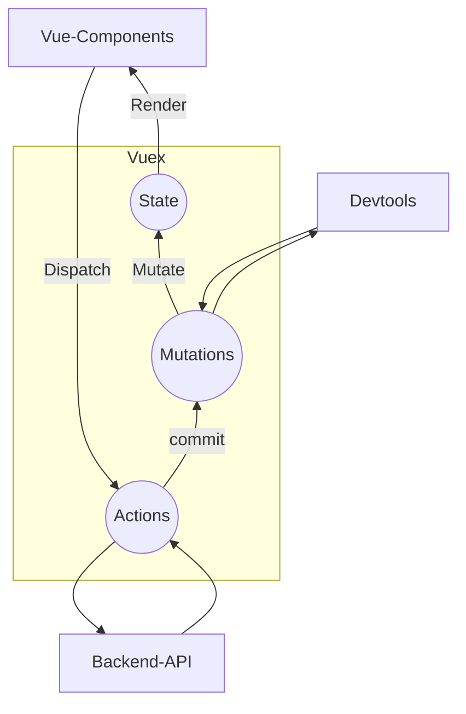

# `Vuex`

`Vuex` 是一个专为`Vue.js`应用程序开发的状态管理模式

## 状态管理模式

可以简单的看成多个组件共享的变量全部存储在一个对象里面

然后将这个对象放在顶层`Vue`实例中，让其他组件可以使用




## 管理什么

比如用户的登录，用户名称，头像，地理位置信息等

## 单个组件的状态管理

- `state`：在单个组件中，`state`代表的状态就是保存在`data`中的数据， 数据显示在`View`中
- `view`：`state`的数据显示在`view`，`view`可以产生`actions`
- `action`s：在`view`可以发生行为，同时行为可以改变`data`

## 多个组件的状态管理

- `state`: 多个组件中，`state`代表的状态保存在`vuex`中

# `Vuex`使用

## 安装

可以使用`vuex-cli3.x`在`create`时勾选`vuex`创建，

也可以使用`npm install vuex --save-dev`

## 使用

创建`/src/stroe/index.js`文件

插入：

```js
import Vue from 'vue'
import Vuex from 'vuex'

Vue.use(Vuex)

const store = new Vuex.Store({
  state: {
  },
  mutations: {
  },
  actions: {
  },
  modules: {
  }
})

export default store
```

在`main.js`中

```js
import store from './store'

new Vue({
    //...
    store,
})
```

`Vue-cli3.x`会自动创建

### `state`

`Vuex`保存的状态信息，一旦`store`挂载完成，在所有的组件中， 使用`$store.state.xxx`,就可以得到状态的值

```js
state: {
    counter: 1000
},
```

### 修改`state`




`Vuex`状态管理图例中，`State`的状态只能由`Mutations`修改，

修改流程： `Vue Components`首先发布一个`Actions`，由`Actions`提交一个`Mutations`，再由`Mutations`来修改

`Devtools`: `Vue`开发的一个浏览器插件，可以每次记录`State`修改的状态，可以跟踪那些组件修改了`State`，定位错误

`Devtools`是修改`State`的关键，不可以跳过，有时可以跳过`Actions`，直接进行`Mutations`进行修改

有异步操作时需要通过`Actions`修改`State`

### `Devtools`

#### 安装

在浏览器中插件商店中下载`devtools`,截至到`2020-12-17`日，`devtools`版本尚未支持`Vue3`,在浏览器界面无法查看`Vuex`

#### `mutations`

在`store/index.js`中的`mutations`添加方法

方法自带一个默认参数`state`

```js
mutations: {
    increment (state) {
      state.counter++
    },
    decrement (state) {
      state.counter--
    }
  },
```

在调用时

```js
<button @click="Addition">+</button>
<button @click="Subtraction">-</button>
methods: {
    Addition () {
        this.$store.commit('increment')
    },
        Subtraction () {
            this.$store.commit('decrement')
        }
}
```

## `Vuex` 五个核心概念

### `State`

保存状态的地方

#### `State`单一状态树

也可以叫单一数据源

当你有很多信息时，`Vuex`推荐只使用一个数据源

只`new` 一个 `store`

### `Getters`

当使用计算属性时，在`Getters`中添加计算属性

```js
getters: {
    powerCounter (state) {
        return state.counter * state.counter
    }
},
```

调用时：

```js
<h2>{{ $store.getters.powerCounter }}</h2>
```

#### `Getters`传参

`Getters`中的计算属性传参时，传入的是`getters`,这个`getters`就是`getters`本身，

```js
more20Stu(state) {
    return state.students.filter(s=>s.age > 20)
},
more20StuLen(state, getters) {
    return getters.more20Stu.length
}
```

#### `Getters`传参

当给计算属性传入非`getters`的参数时，使用

```js
moreAgeStu(state) {
    return function(age) {
        return state.students.filter(s=>s.age>age)
    }
}
```

计算属性返回一个函数，函数可以接收其他的参数

使用时：

```js
<h2>{{ $store.getters.moreAgeStu(8) }}</h2>
```

### `Mutation`

`Vuex`的`store`状态更新唯一方式：提交`Mutation`

#### `Mutation`主要包括两部分：

- 字符串的时间类型(`type`)
- 一个回调函数(`handler`)，该回调函数的第一个参数时`state`

#### `mutation`定义方式

```js
increment (state) {
    state.counter++
},
传参数
increment (state, count) {
    state.counter += count
},
```

#### 通过`mutation`更新

```js
Addition () {
    this.$store.commit('increment')
},
传参
Addition (count) {
    this.$store.commit('increment', count)
},
```

参数被称为`mutation`的载荷(`Payload`)

#### 提交风格

普通提交风格

```js
this.$store.commit('increment')
```

特殊提交风格

```js
this.$store.commit({
	type: 'increment',
    count,
})
```

使用这种风格时，在接收的时所有参数被包装成一个对象`payload`

```js
increment (state, payload) {
    state.counter += payload.count
},
```

#### `Mutation`响应式规则

`mutation`的响应规则是变量必须在`store`中定义

 在`store`中定义的属性，都会被加入到响应式系统中，而响应式系统会监听属性的变化

当属性发生变化时，会通知所有界面中用到该属性的地方，让界面发生刷新

没在`store`中定义的属性，不会发生响应式

可以使用`Vue.set`来操作对象实现响应式

```js
Vue.set添加属性
Vue.set(object, key, value)
Vue.set删除属性
Vue.delete(object, key)
```

#### ` Mutation` 的常量类型

创建常量文件`/store/mutations-type.js`

```js
export const INCREMENT = "increment"
```

在创建方法时

```js
import { INCREMENT } from './mutations-types'
mutations: {
    //...
    [INCREMENT] (state) {
        state.counter++
    },
}
```

在使用时

```js
import { INCREMENT } from './store/mutations-types'

methods: {
    //...
    Addition () {
      this.$store.commit(INCREMENT)
    },
  }
```

#### `Mutation`同步函数

`Vuex`要求`mutation`中的方法必须时同步方法

### `Actions`

在`actions`中执行异步操作

`actions`中创建的方法，默认参数`context`，可以理解为`store`对象

```js
aUpdate (context) {
    setTimeout(() => {
        context.commit(INCREMENT)
    }, 1000)
}
```

`actions`异步操作不能跳过`mutation`，所以使用`commit`调用`mutation`方法

使用`dispatch`调用`actions`

```js
Addition () {
      this.$store.dispatch('aUpdate')
},
```

#### 传参

```js
Addition () {
      this.$store.dispatch('aUpdate', 'payload负载')
},
```

```js
aUpdate (context, payload) {
    setTimeout(() => {
        context.commit(INCREMENT)
        console.log(payload)
    }, 1000)
}
```

#### 回调

当`actions`成功完成后，使用回调返回一个成功信息

`payload`可以传递一个对象，在`payload`对象中传递一个函数，当成功执行`actions`后，执行函数

```js
Addition () {
    // this.$store.commit(INCREMENT)
    this.$store.dispatch('aUpdate', {
        message: "我是message",
        success: () => {
            console.log('执行成功')
        }
    })
},
```

```js
aUpdate (context, payload) {
    setTimeout(() => {
        context.commit(INCREMENT)
        console.log(payload.message)
        payload.success()
    }, 1000)
}
```

使用`Promise`

```js
Addition () 
    this.$store.dispatch('aUpdate', 'payload').then(res => {
        console.log(res)
        console.log('回调成功')
    })
},
```

```js
aUpdate (context, payload) {
    return new Promise((resolve, reject) => {
        console.log(payload)
        resolve('1111')
    })
}
```

`aUpdate`方法返回一个`Promise`对象，`Addition`方法接收到对象可以写`then`函数对回调完成做一些操作

### `Module`

`Vue`建议使用单一状态树，但是这样会使得`state`变得极为臃肿，

为了解决这个问题，`Vuex`允许我们将`store`分割成模块，而每个模块拥有自己的`states`，`mutations`，`actions`，`getters`等

```js
const moduleB = {
  state: {},
  mutations: {},
  actions: {},
  getters: {}
}
modules: {
    a: {
      state: {},
      mutations: {},
      actions: {},
      getters: {}
    },
    b: moduleB
  }
```

#### 使用

##### `state`

```js
const moduleB = {
  state: {
    name: 'zhangsan'
  },
  mutations: {},
  actions: {},
  getters: {}
}

```

在`app.vue`中使用

`<h2>{{ $store.state.b.name }}</h2>`

来获取模块`B`中的属性

##### `mutation`

````js
const moduleB = {
  state: {
    name: 'zhangsan'
  },
  mutations: {
    updataName (state, payload) {
      state.name = payload
    }

  },
  actions: {},
  getters: {}
}
````

```js
<button @click="updataName">修改名字</button>
//...
updataName () {
    this.$store.commit('updataName', 'lisi')
}
```

模块中的`mutations`也是直接通过`commit`来使用，这也导致不同模块之间的`mutations`方法不能重名

##### `getters`

```js
 getters: {
    fullName (state) {
      return state.name + '111'
    },
    fullName2 (state, getters) {
      return getters.fullName + '222'
    }
  }
```

```js
<h2>{{ $store.getters.fullName }}</h2>
<h2>{{ $store.getters.fullName2 }}</h2>
```

不同模块之间的`getters`也是直接调用

跨模块使用其他模块的`state`，在模块中的`getters`里， 可以传入第三个参数`rootState`

```js
fullName3 (state, getters, rootState) {
      return getters.fullName2 + rootState.counter
}
```

```js
<h2>{{ $store.getters.fullName3 }}</h2>
```

##### `actions`

在模块中的`actions`里的默认参数`context`，不再能理解为`store`，这里的`context.commit`提交的话是调用本身`module`的`mutatinos`中的方法，

```js
 aUpdateName (context) {
     setTimeout(() => {
         context.commit('updateName', 'wangwu')
     }, 1000)
 }
```

```js
<button @click="asyncUpdataName">异步修改</button>
asyncUpdataName () {
    this.$store.dispatch('aUpdateName')
}
```

在模块中的`context`里面包含

`commit, dispatch, getters, rootGetters, rootState,state`

只有在模块中的`context`才包含根和模块本身的属性

